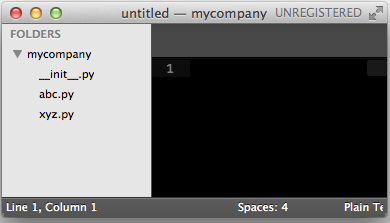
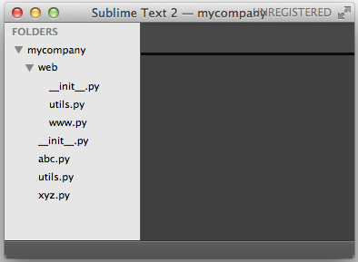

### 模块

1.举个例子，一个`abc.py`的文件就是一个名字叫`abc`的模块，一个`xyz.py`的文件就是一个名字叫`xyz`的模块。

如果`abc.py`或者`xyz.py`模块名称跟其他模块冲突了,我们可以通过***包***的格式进行去除冲突.方法就是创建一个新的文件夹,给予这个文件夹命名,比如`mycompany`,将我们冲突的模块存放到这里,并且添加`__init__.py`文件,则我们的模块就会变成:`mycompany.abc`和`mycompany.xyz`,如图:

每一个包目录下面都会有一个`__init__.py`的文件，这个文件是必须存在的，否则，Python就把这个目录当成普通目录，而不是一个包

举例:

文件`www.py`的模块名是`mycompany.web.www`

自己创建模块时要注意命名，不能和Python自带的模块名称冲突。例如，系统自带了`sys`模块，自己的模块就不可命名为`sys.py`，否则将无法导入系统自带的`sys`模块。