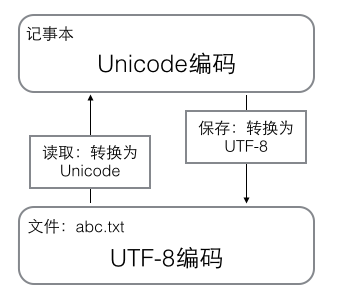

## python学习笔记

---

## python基础

### print打印方法
1.打印字符串到控制台
`>>> print('helloworld')`

2.如果需要打印转义字符,可以使用**" \ "**进行转义,比如:
`>>> print('\t')` 将会打印制表符,一般是4个空格

3.如果打印的内容都不需要进行转义,可以使用`r''`进行包裹,比如:
`>>> print(r'\\\t\\')`
将会打印出`\\\t\\`
如果不使用`r''`包裹,则会被直接转义,输出`\		\`;中间是一个制表符

4.print函数可以接受多个参数,用逗号隔开,最终打印出来会连在一起,逗号转化为空格
`>>> print('hello','this is','my world')`
打印直接显示:hello this is my world

5.如果字符串有很多换行,则使用'\n'不是很好阅读,python提供了解决方法,使用`'''...'''`表示多行内容:

		>>> print('''line1

		...line2

		...line3''')

直接显示:
line1
line2
line3

上面是在交互式命令行内输入，注意在输入多行内容时，提示符由`>>>`变为`...`，提示你可以接着上一行输入。

---

### input输入方法
输入方法可以接受标准输入,比如:
`>>> name=input()`
`'helloworld'`
`>>> name`
将会显示name的值已经是'helloworld'

---

### 数据类型和变量

1.空值是Python里一个特殊的值，用`None`表示。`None`不能理解为`0`，因为`0`是有意义的，而`None`是一个特殊的空值。

2.Python的整数没有大小限制，而某些语言的整数根据其存储长度是有大小限制的，例如Java对32位整数的范围限制在`-2147483648-2147483647`。
Python的浮点数也没有大小限制，但是超出一定范围就直接表示为`inf`（无限大）。

3.python除法分为两种,一种是直接出发,用`/`表示,另一种是地板除,用`//`表示,下面看命令:
`>>> 10 / 3`
结果为:3

`>>> 10.0 / 3.0`
结果为:3.3333333333333

`>>> 10.0 // 3.0`
结果却为:3.0

因为`//`除法只取结果的整数部分

---

### 字符串和编码

1.现在计算机系统通用的字符编码工作方式：
在计算机内存中，统一使用Unicode编码，当需要保存到硬盘或者需要传输的时候，就转换为UTF-8编码。
用记事本编辑的时候，从文件读取的UTF-8字符被转换为Unicode字符到内存里，编辑完成后，保存的时候再把Unicode转换为UTF-8保存到文件：

2.python3的字符串是使用Unicode编码的,也就是说python支持多语言内容显示;

3.对单个字符的编码,python提供了`ord()`函数获取字符的整数表示,`chr()`函数把编码转换为对应的字符,下面看代码内容:
`>>> ord('A')`
显示为:65
`>>> ord('中')`
显示为:20013
`>>> chr(66)`
显示为'B'

4.由于python的字符串类型在内存中以Unicode编码表示,一个字符对应若干个字节,如果要在网络上传输,或者保存到磁盘上,就需要把字符串类型转换为字节为单位的`bytes`;
python对`bytes`类型的数据用`b`前缀的单引号或者双引号表示:
`>>> x=b'ABC'`
要注意区分`'ABC'`和`b'ABC'`，前者是str，后者虽然内容显示得和前者一样，但bytes的每个字符都只占用一个字节。

将字符串转为字节类型,可以使用`encode()`方法;
将字节类型转为字符串,可以使用`decode()`方法;
`>>> 'ABC'.encode('ascii')`
`>>> '中文'.encode('utf-8')`
字符串在encode的时候需要使用指定的编码类型,中文不能使用`ascii`编码,不然会报错

`>>> b'ABC'.decode('ascii')`
`>>> b'\xe4\xb8\xad\xe6\x96\x87'.decode('utf-8')`

要计算字符串包含多少个字符,可以使用`len()`函数
`>>> len('ABC')`
返回的是:3
`>>> len('中文')`
返回的是:2

`len()`函数计算的是字符串的字符数,如果把参数换成`bytes`类型,则`len()计算的是字节数`
`>>> len(b'ABC')`
返回的是:3
`>>> len(b'\xe4\xb8\xad\xe6\x96\x87')`
返回的是:6
`>>> len('中文'.encode('utf-8'))`
返回的是:6

---

第一行:告诉linux/os x系统,这是一个python可执行程序,windows系统会忽略这个注释
第二行:告诉python解释器,按照utf-8编码读取源代码
第三行:正式代码

---

### 格式化输出

格式化输出也就是在语句中使用占位符,比如`%s,%d`之类的,在后面再进行参数的补充;

`>>> 'Hello, %s' %'world'`

显示为:'Hello, world'

`>>> 'Hi, %s, you have $%d' %('Jack',1000)`

输出为:'Hi, Jack, you have $1000'

`%d`和`%f`可以进一步格式化:

`>>> '%2d-%02d' %(3,1)`

显示:' 3-01'	*注意3前面有一个空格*

`>>> '%.2f' % 3.1415926`

显示:'3.14'

如果要显示`%`这个字符,则可以使用转义:`%%`

`>>> 'growth rate: %d %%' % 7`

显示为:'growth rate: 7 %'

---

### list和tuple

#### list

1.声明list的方式:(list下标从0开始,超过元素个数会报错)

`>>> classmates = ['one','two','three']`

2.返回list里面元素的个数:

`>>> len(classmates) `

显示的结果是:3

3.可以使用-1下标来访问list的最后一个元素,同理,倒数第二个元素使用下标-2,比如:

`>>> classmates[-1]`

显示的结果是:'three'

`>>> classmates[-2]`

显示的结果是:'two'

4.list中元素操作:

**append**   操作:将元素追加到list的末尾

`>>> classmates.append('jack')`

**insert**  操作:将元素插入到指定的位置

`>>> classmates.insert(1,'Jack')`

**pop**  操作:将删除元素,分成两种情况`pop()`删除list末尾的元素;`pop(i)`删除指定下标的元素;

`>>> pop()`

`>>> pop(1)`

要把某个元素替换成别的元素，可以直接赋值给对应的索引位置：

`>>> classmates[1] = 'Sarah'`

5.list中的元素的数据类型可以不同:

`>>> L = ['Apple', 123, True]`

6.list中的元素可以包含另外一个list

`>>> L = ['python','java',['asp','php'],'scheme']`

或者:

`>>> p = ['asp','php']`
`>>> s = ['python', 'java', p, 'scheme']`

要拿到`php`可以写成`p[1]`或者`s[2][1]`;

7.如果一个list中一个元素也没有，就是一个空的list，它的长度为0：

`>>> L = []`
`>>> len(L)`

返回的是:0

#### tuple

1.tuple是不可改变的数组,除了数据和结构不能改变之外,其他的跟list都是一样的;也就是tuple没有`insert`,`append`等方法,**也不支持给某个元素进行赋值**

2.声明方式:

`>>> t = (1,2)`

`>>> t = ()` 声明一个空的tuple

3.误区:(声明只有1个元素,需要注意的是:)

`>>> t = (1)`  这个是`t`赋值为`1`,不是生命一个tuple类型;

这是因为`()`既可以表示tuple,又可以表示数学公式中的小括号,这就产生了歧义,因此,python规定,这种情况下,按小括号进行计算,计算结果自然是`1`.所以,只有1个元素的tuple定义时必须加一个逗号`,`,来消除歧义

`>>> t = (1, )`
`>>> t`

结果显示:(1, )

4.实现一个"可变"的tuple

tuple本身不可变,但是tuple如果它的元素中有可变的内容,比如tuple里面添加了一个list,则可以改变list内容,但是不代表tuple发生了变化,所以是合理的:

`>>> t = ['a','b',['A','B']]`
`>>> t[2][0] = 'X'`
`>>> t[2][1] = 'Y'`
`>>> t`

结果显示:('a','b',['X','Y'])

所以，tuple所谓的“不变”是说，tuple的每个元素，指向永远不变。即指向`'a'`，就不能改成指向`'b'`，指向一个list，就不能改成指向其他对象，但指向的这个list本身是可变的！要创建一个内容也不变的tuple怎么做？那就必须保证tuple的每一个元素本身也不能变。

### 条件判断

1.条件判断使用的关键字有`if`,`else`,`elif`,下面看代码:

	age = 3
	if age >= 18:
		print("your age is", age)
		print("adult")
	elif age >= 6:
		print("teenager")
	else:
		print("kid")

***注意不要少写了冒号`:`***

2.input输入的条件判断
input输入默认的是字符串类型,如果要进行数值判断,需要转型,使用`int()`方法转为数值类型

***下面是错误示例:***

	birth = input('birth: ')
	if birth < 2000:
	    print('00前')
	else:
	    print('00后')

输入`1111`,结果报错;

***下面是正确示例***

	s = input('birth: ')
	birth = int(s)
	if birth < 2000:
	    print('00前')
	else:
	    print('00后')

### 循环

1.for循环

	names = ['Michael', 'Bob', 'Tracy']
	for name in names:
	    print(name)

上面代码,循环`names`里面的元素,把每个元素都赋值给`name`变量

2.range方法

	sum = 0
	for x in range(101):
	    sum = sum + x
	print(sum)

`range(i)`方法可以生成一个整数序列,上面的代码指定生成从`0`到`100`的整数

3.while循环

直接贴下面的代码,不解释

	sum = 0
	n = 99
	while n > 0:
	    sum = sum + n
	    n = n - 2
	print(sum)

4.break关键字和continue关键字

**解释:**
`break`关键字提前退出整个循环;
`continue`关键字提前结束当前的这一层循环,直接进行下次的循环

	n = 1
	while n <= 100:
	    print(n)
	    n = n + 1
	print('END')

如果使用`break`语句,则会提前结束循环

	n = 1
	while n <= 100:
	    if n > 10: # 当n = 11时，条件满足，执行break语句
	        break # break语句会结束当前循环
	    print(n)
	    n = n + 1
	print('END')

如果使用`continue`关键字则会结束这次循环,进而进入下一次循环

	n = 0
	while n < 10:
	    n = n + 1
	    if n % 2 == 0: # 如果n是偶数，执行continue语句
	        continue # continue语句会直接继续下一轮循环，后续的print()语句不会执行
	    print(n)

### dict和set数据结构

#### dict

1.dict全称dictionary,就是java中的map集合,使用键值对存储数据;

`>>> d = {'Michael' : 95, 'Bob' : 75, 'Tracy' : 85}`
`>>> d['Michael']`

结果显示:95

这种key-value存储方式，在放进去的时候，必须根据key算出value的存放位置，这样，取的时候才能根据key直接拿到value

2.设置某个key中的value值,可以使用:
`>>> d['Michael'] = 100`
`>>> d['Michael']`

结果显示:100

*如果给不存在的key赋值,将会报错*,要避免key不存在的错误,有两种方法:

**第一种**:使用`in`判断key是否存在:

`>>> 'Michael' in d`

结果显示:true

**第二种**:通过dict提供的`get`方法,如果key不存在,返回`None`,或者自己定义指定的value:

`>>> d.get('Thomas')`
`>>> d.get('Thomas', -1)`

第一行代码,如果返回`None`,在交互界面是没有显示内容的
第二行代码,如果没有这个key,则返回我们规定的`-1`

删除某个key-value值,可以使用`pop`方法:

`>>> d.pop('Bob')`
75

***dict内部存放的顺序和key放入的顺序是没有关系的***

***dict的key必须是不可变对象***:因为dict根据key来计算value的存储位置，如果每次计算相同的key得出的结果不同，那dict内部就完全混乱了。这个通过key计算位置的算法称为哈希算法

#### set

1.set集合不存储重复的值

`>>> s = set([1, 2, 3])`
`>>> s`

显示的内容是:{1, 2, 3}

注意，传入的参数`[1, 2, 3]`是一个list，而显示的`{1, 2, 3}`只是告诉你这个set内部有`1，2，3`这3个元素，显示的顺序也不表示set是有序的。。

2.set可以做集合运算:

`>>> s1 = set([1, 2, 3])`
`>>> s2 = set([2, 3, 4])`
`>>> s1 & s2`

显示的结果是:{2, 3}

`>>> s1 | s2`

显示的结果是:{1, 2, 3, 4}

***set跟dict一样,不可以放入可变对象***,因为无法判断两个可变对象是否相等，也就无法保证set内部“不会有重复元素”

