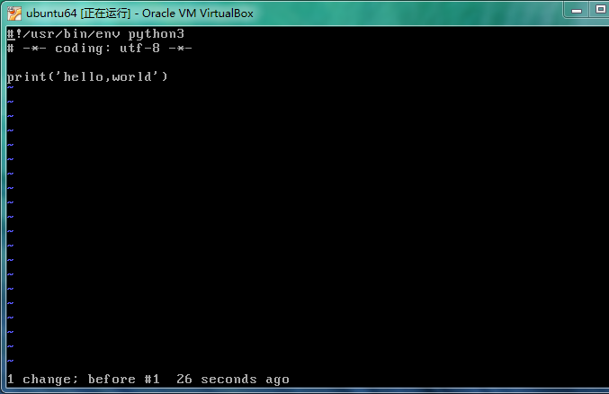

## python学习笔记

---

### print打印方法
1.打印字符串到控制台
`>>> print('helloworld')`

2.如果需要打印转义字符,可以使用**" \ "**进行转义,比如:
`>>> print('\t')` 将会打印制表符,一般是4个空格

3.如果打印的内容都不需要进行转义,可以使用`r''`进行包裹,比如:
`>>> print(r'\\\t\\')`
将会打印出`\\\t\\`
如果不使用`r''`包裹,则会被直接转义,输出`\		\`;中间是一个制表符

4.print函数可以接受多个参数,用逗号隔开,最终打印出来会连在一起,逗号转化为空格
`>>> print('hello','this is','my world')`
打印直接显示:hello this is my world

5.如果字符串有很多换行,则使用'\n'不是很好阅读,python提供了解决方法,使用`'''...'''`表示多行内容:

		>>> print('''line1

		...line2

		...line3''')

直接显示:
line1
line2
line3

上面是在交互式命令行内输入，注意在输入多行内容时，提示符由`>>>`变为`...`，提示你可以接着上一行输入。

---

### input输入方法
输入方法可以接受标准输入,比如:
`>>> name=input()`
`'helloworld'`
`>>> name`
将会显示name的值已经是'helloworld'

---

### 数据类型和变量

1.空值是Python里一个特殊的值，用`None`表示。`None`不能理解为`0`，因为`0`是有意义的，而`None`是一个特殊的空值。

2.Python的整数没有大小限制，而某些语言的整数根据其存储长度是有大小限制的，例如Java对32位整数的范围限制在`-2147483648-2147483647`。
Python的浮点数也没有大小限制，但是超出一定范围就直接表示为`inf`（无限大）。

3.python除法分为两种,一种是直接出发,用`/`表示,另一种是地板除,用`//`表示,下面看命令:
`>>> 10 / 3`
结果为:3

`>>> 10.0 / 3.0`
结果为:3.3333333333333

`>>> 10.0 // 3.0`
结果却为:3.0

因为`//`除法只取结果的整数部分

---

### 字符串和编码

1.现在计算机系统通用的字符编码工作方式：
在计算机内存中，统一使用Unicode编码，当需要保存到硬盘或者需要传输的时候，就转换为UTF-8编码。
用记事本编辑的时候，从文件读取的UTF-8字符被转换为Unicode字符到内存里，编辑完成后，保存的时候再把Unicode转换为UTF-8保存到文件：

2.python3的字符串是使用Unicode编码的,也就是说python支持多语言内容显示;

3.对单个字符的编码,python提供了`ord()`函数获取字符的整数表示,`chr()`函数把编码转换为对应的字符,下面看代码内容:
`>>> ord('A')`
显示为:65
`>>> ord('中')`
显示为:20013
`>>> chr(66)`
显示为'B'

4.由于python的字符串类型在内存中以Unicode编码表示,一个字符对应若干个字节,如果要在网络上传输,或者保存到磁盘上,就需要把字符串类型转换为字节为单位的`bytes`;
python对`bytes`类型的数据用`b`前缀的单引号或者双引号表示:
`>>> x=b'ABC'`
要注意区分`'ABC'`和`b'ABC'`，前者是str，后者虽然内容显示得和前者一样，但bytes的每个字符都只占用一个字节。

将字符串转为字节类型,可以使用`encode()`方法;
将字节类型转为字符串,可以使用`decode()`方法;
`>>> 'ABC'.encode('ascii')`
`>>> '中文'.encode('utf-8')`
字符串在encode的时候需要使用指定的编码类型,中文不能使用`ascii`编码,不然会报错

`>>> b'ABC'.decode('ascii')`
`>>> b'\xe4\xb8\xad\xe6\x96\x87'.decode('utf-8')`

要计算字符串包含多少个字符,可以使用`len()`函数
`>>> len('ABC')`
返回的是:3
`>>> len('中文')`
返回的是:2

`len()`函数计算的是字符串的字符数,如果把参数换成`bytes`类型,则`len()计算的是字节数`
`>>> len(b'ABC')`
返回的是:3
`>>> len(b'\xe4\xb8\xad\xe6\x96\x87')`
返回的是:6
`>>> len('中文'.encode('utf-8'))`
返回的是:6

---

第一行:告诉linux/os x系统,这是一个python可执行程序,windows系统会忽略这个注释
第二行:告诉python解释器,按照utf-8编码读取源代码
第三行:正式代码

---

### 格式化输出

格式化输出也就是在语句中使用占位符,比如`%s,%d`之类的,在后面再进行参数的补充;

`>>> 'Hello, %s' %'world'`
显示为:'Hello, world'

`>>> 'Hi, %s, you have $%d' %('Jack',1000)`
输出为:'Hi, Jack, you have $1000'

`%d`和`%f`可以进一步格式化:
`>>> '%2d-%02d' %(3,1)`
显示:' 3-01'	*注意3前面有一个空格*

`>>> '%.2f' % 3.1415926`
显示:'3.14'

如果要显示`%`这个字符,则可以使用转义:`%%`
`>>> 'growth rate: %d %%' % 7`
显示为:'growth rate: 7 %'

